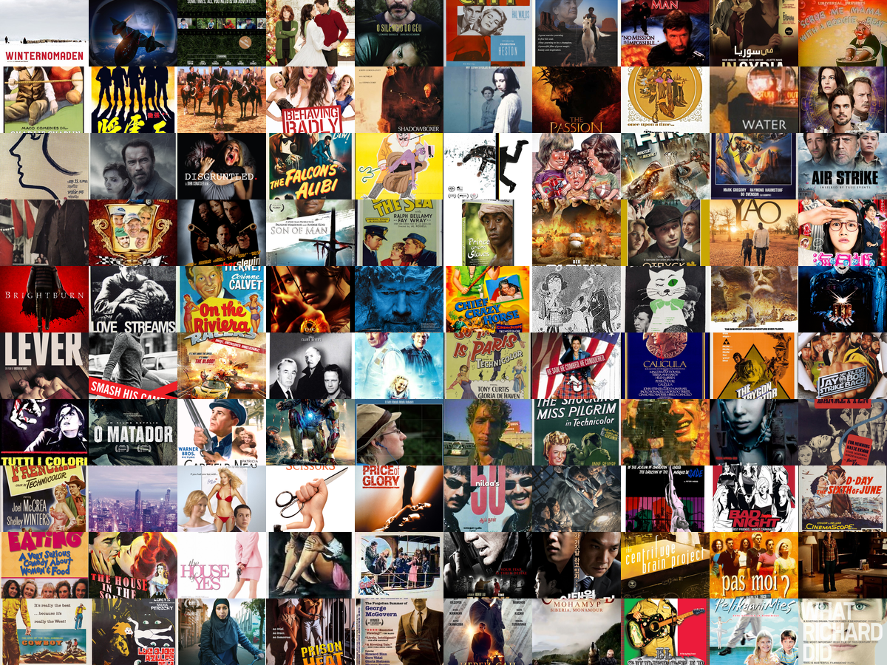

# posterlens-clustering



PosterLens Clustering explores how movie poster embeddings group together under different clustering algorithms. The project reduces high-dimensional PosterLens-25 image embeddings, compares clustering quality across methods, and publishes an interactive Plotly visualization so the resulting structure is easy to inspect.

This repository includes the clustering pipeline, evaluation code, and a static Plotly visualization that can be hosted on GitHub Pages.

## What you can explore

The visualization lets you:

- Switch between K-Means, Gaussian Mixture, and Hierarchical clustering
- Compare multiple cluster counts
- Rotate, zoom, and pan the 3D embedding plot
- Legend click / hide behavior on the scatter plot
- Review the elbow-method distortion curves across all three methods

## For visitors

If you are visiting the project page, open the published GitHub Pages site and use the dropdowns to change:

- Clustering method
- Number of clusters

The 3D scatter plot supports the standard Plotly interactions directly in the browser, so you can inspect the embedding structure from different angles and isolate clusters by clicking items in the legend.

## Running locally

If you want to regenerate the visualization locally, install the required Python packages:

```bash
pip install numpy scipy scikit-learn plotly kagglehub
```

The clustering script currently expects a local `embedding/` directory in the repository root containing PosterLens embedding `.npy` files.

Generate the clustering outputs:

```bash
python clustering.py
```

Build the static site:

```bash
python visualization.py
```

This writes the visualization to `docs/index.html`.

## Project files

- `clustering.py` runs PCA, clustering, and distortion evaluation
- `visualization.py` exports the static Plotly visualization
- `visual_data.npy` stores the PCA coordinates and cluster labels
- `performance.npy` stores the distortion values used by the elbow plot
- `docs/index.html` is the generated GitHub Pages site

## Publishing

To publish on GitHub Pages:

1. Commit the `docs/` directory.
2. In GitHub repository settings, set Pages to deploy from the `main` branch and `/docs` folder.
3. Push changes.

## Dataset

PosterLens-25M dataset:
https://www.kaggle.com/aptlin/posterlens-25m
